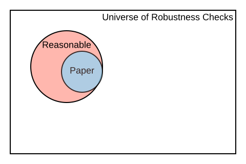

background-image: url("Images/BITSSlogo.png"), url(Images/cega.png)
background-size: contain, 200px
background-position: 50% 100% , 0% 100% 
count:true 

#[BITSS](https://bitss.org)   

<style>

.center2 {
  margin: 0;
  position: absolute;
  top: 50%;
  left: 50%;
  -ms-transform: translate(-50%, -50%);
  transform: translate(-50%, -50%);
}


pre.sourceCode {
    max-height: 200px;
    overflow-y: auto;
}


/*
.remark-slide-number {
  position: inherit;
}

.remark-slide-number .progress-bar-container {
  position: absolute;
  bottom: 0;
  height: 4px;
  display: block;
  left: 0;
  right: 0;
}

.remark-slide-number .progress-bar {
  height: 100%;
  background-color: blue;
}
*/
</style>


```{css, echo=FALSE}
# CSS for including pauses in printed PDF output (see bottom of lecture)
@media print {
  .has-continuation {
    display: block !important;
  }
}

```


```{r setup, include=FALSE}
options(htmltools.dir.version = FALSE)
library(knitr)
opts_chunk$set(
  fig.align="center",  
  fig.height=4, #fig.width=6,
  # out.width="748px", #out.length="520.75px",
  dpi=300, #fig.path='Figs/',
  cache=T ,#, 
  echo=F #warning=F, message=F
  )
library(tidyverse)
library(hrbrthemes)
library(fontawesome)

```


.pull-left[
The Berkeley Initiative for Transparency in the Social Sciences works to improve </br>the credibility of science by </br>
advancing transparency, </br> reproducibility,  rigor, and </br> ethics in research. 

.font130[**Core Team**]
  

 Aleks Bogdanoski  

 Fernando Hoces  de la Guardia
 
 Katie Hoeberling  
 
 Edward Miguel

]
.pull-right[ .right[
We are part of the Center for Effective Global Action ([CEGA](https://cega.berkeley.edu/)).   
 </br></br></br></br></br></br></br>
.font130[**Many Others**]

CEGA staff

Undergrad and Graduate RAs

Catalysts

Outside Collaborators   
(Researchers, Programmers)
  ]]
 


---

background-image: url("Images/ecosystem.PNG"), url(Images/cega.png)
background-size: contain, 200px
background-position: 50% 100% , 0% 100% 
name: about-bitss
count:true 

# Part of the much larger Open Science Community 

---

# Table of Contents 

</br>
.font130[
1. [Problems](#motivation)

2. [Solutions](#bitss)

3. [Accelerating Computational Reproducibility](#acre)

4. [Open Policy Analysis](#opa)


]

---
count:false

# Table of Contents 

</br>
.font130[
1. [**Problems**](#motivation)

2. [Solutions](#bitss)

3. [Accelerating Computational Reproducibility](#acre)

4. [Open Policy Analysis](#opa)

]


---
name: motivation

# What does it mean to do good science?

.font140[
Scientific Norms (Merton, 1942, [1973](https://sciencepolicy.colorado.edu/students/envs_5110/merton_sociology_science.pdf)): 

- **Disinterestedness**: search for the truth

- **Organized skepticism**: peer review and replication

- **Communality**: researchers should share all the scientific output (papers, data, code and materials) 

- **Universalism**: validity comes from quality of a scientific finding and not the hierarchies of those making the claims.
]


---
background-image: url("Images/AMdV2007_01.PNG")
background-size: contain
background-position: 50% 100%  
count:false

# .font80[Researchers and Scientific Norms (Anderson et. al., 2007)]


---
background-image: url("Images/AMdV2007_02.png")
background-size: contain
background-position: 50% 100%  
count:false

# .font80[Researchers and Scientific Norms (Anderson et. al., 2007)]


---
background-image: url("Images/AMdV2007.png")
background-size: contain
background-position: 50% 100%  
count:true

# .font80[Researchers and Scientific Norms (Anderson et. al., 2007)]


---
background-image: url("Images/Brodeur.PNG")
background-size: contain
background-position: 50% 100%  


# P-hacking (for Economics: Brodeur et. al 2016, 2020)


---
background-image: url("Images/Tess.PNG")
background-size: contain
background-position: 50% 100%  


# Publication Bias (Franco et. al. 2014)


---
# .font80[ Low Replicability and Reproducibility ("Reproducibility Crisis")]
</br></br>

.font180[
| Replication in Social Sciences<br>(same method, different sample) 	| Reproduction in Economics<br>(same data and methods) 	|
|-------------------------------------------------------------------	|------------------------------------------------------	|
| OSC ([2015](https://docs.google.com/document/d/1mm_4HZnEz_2Bh8XuiS2tpqCH08MFPyqUhi1baKPqR8Y/edit#heading=h.7vqf2cziid7z)): 30%-60%                      	                          | Chang & LiRobustness ([2015](https://www.nowpublishers.com/article/Details/CFR-0053)): 43%                               	|
| Camerer et. al. ([2016](https://science.sciencemag.org/content/351/6280/1433)): ~60%                                      	| Gertler et. al. ([2017](https://www.nature.com/articles/d41586-018-02108-9)): 14%                          	|
| Nosek & Camerer et. al. ([2018](https://www.nature.com/articles/s41562-018-0399-z)): ~60%                              	| Kingi et. al. ([2018](https://hautahi.com/static/docs/Replication_aejae.pdf)): 43%                            	|
| Klein et. al. ([2018](https://journals.sagepub.com/doi/10.1177/2515245918810225)): 50%                                         	| Wood et. al. ([2018](https://journals.plos.org/plosone/article?id=10.1371/journal.pone.0209416#abstract0)): 25%                             	|
]

---
count:false

# Table of Contents 

</br>
.font130[
1. [Problems](#motivation)

2. [**Solutions**](#bitss)

4. [Accelerating Computational Reproducibility](#acre)

5. [Open Policy Analysis](#opa)

]
---
name: bitss 

# .font80[Main Solutions]

.font140[
1. Registrations

2. Pre Analysis Plans 

3. Computational Reproducibility

]


---

# Registrations
<br>
.font130[
- A registration is a record that contains minimal information about a study: title, authors, study country, status, keywords, abstract, start and end dates, outcomes, intervention information, basic research design, whether or not treatments are clustered (when performing an RCT), and Institutional Review Board (IRB) information. 


- Preferably, it should be recorded before analyzing data

- **The main goal:** track the complete body of knowledge in a topic of research, regardless of the direction and magnitude of the results.

]


---
background-image: url("Images/plosone.PNG")
background-size: contain
background-position: 50% 100%  

# Why Register: Kaplan and Irvin (2015)


---
# Pre-Analysis Plans
<br>
.font140[
- PAPs are **extensive** methodological descriptions of the analysis to be performed before the endline data is collected

- Helps to prevents p-hacking  

- Only way to guarantee accurate statistical testing

- Distinguishes confirmatory from exploratory analysis
]

---
# Common Concerns About PAPs
<br>
.font130[
|                                                           Critique                                                           |                                                                                                Response                                                                                               |
|:----------------------------------------------------------------------------------------------------------------------------:|:-----------------------------------------------------------------------------------------------------------------------------------------------------------------------------------------------------:|
|                                PAPs take too much time and are <br>too difficult (Olken 2015)                                |                                                         A PAP changes the timing of the analytic <br>component, not clear that it increases it                                                        |
|                  Scientific discovery often comes<br>from surprises. PAPs stifle <br>discovery (Olken 2015)                  |           PAPs do not prevent researchers from doing <br>exploratory work; they only require <br>researchers to be clear about the objectives <br>of their analyses (Ofosu and Posner 2020).          |
| If replications are cheap they will <br>rule out false positives, making <br>PAPs irrelevant.<br>(Coffman and Niederle 2015) | Very few experiments are inexpensive as to perform <br>many replications. Moreover, most of the false <br>positives have been identified where experiments <br>are least expensive (lab experiments). |
]

---
background-image: url("Images/GoBifo1.PNG")
background-size: contain
background-position: 50% 100%  
# Why do a PAP: Casey et. al. ([2012](https://academic.oup.com/qje/article-abstract/127/4/1755/1841616?redirectedFrom=fulltext))


---
background-image: url("Images/results_blind_review.png")
background-size: contain
background-position: 50% 100%  
# Another Reason: Register Reports


---
background-image: url("Images/3s_change.png")
background-size: contain
background-position: 50% 100%  
# Change is Happenning: Christensen et. al., ([2020](https://osf.io/preprints/metaarxiv/5rksu/))


---
count:false

# Table of Contents 

</br>
.font130[
1. [Problems](#motivation)

2. [Solutions](#bitss)

4. [**Accelerating Computational Reproducibility**](#acre)

5. [Open Policy Analysis](#opa)

]
---
name:acre

# .font90[Accelerating Computational Reproducibility (ACRe)]     
.font120[
In addition to reproducibility problems, there are two additional motivations for this projects:   
] 

## Motivation 2: More Inclusive Concept Scholarly Output

.font120[
    <blockquote>
    Clarebout Principle:
    </br></br>
    “An article about computational science in a scientific publication is not the scholarship itself, it’s merely scholarship advertisement. The actual scholarship is the complete software development environment and the complete set of instructions which generated the figures.”
</br></br>    
.right[  <cite> Buckheit and D.L. Donoho (1995, [2009](https://academiccommons.columbia.edu/doi/10.7916/D8QZ2MDS/download))</cite> ]
    </blockquote>
]

---

# .font90[Accelerating Computational Reproducibility (ACRe)]     

.font120[
In addition to reproducibility problems, there are two additional motivations for this projects:   
] 

## Motivation 2: More Inclusive Concept Scholarly Output

.font120[
    <blockquote>
    Clarebout Principle:
    </br></br>
    “An <b>article</b> about computational science in a scientific publication is not the scholarship itself, <b>it’s merely scholarship advertisement</b>. The actual <b>scholarship is the complete software development environment and the complete set of instructions which generated the figures</b>.”
</br></br>    
.right[  <cite> Buckheit and D.L. Donoho (1995, [2009](https://academiccommons.columbia.edu/doi/10.7916/D8QZ2MDS/download))</cite> ]
    </blockquote>
]

---
# .font90[M2: More Inclusive Concept Scholarly Output]     

.font130[
Potential benefits of following the Clarebout Principle

Well discussed potential positive effects on:
- Pedagogy  
- Incremental generation of knowledge 
]
--

.font130[
Under discussed:

- Possible positive effect on diversity, equity and inclusion: no connections or language skills ("appropriate politeness") required to obtain materials 
]

???
An under discussed benefit of this principle is that increases access to knowledge for students who are outside of elite schools (no connections or "appropriate politeness" required to obtain materials).   


---

# M3: Prevent Loss of Knowledge  

Every semester, graduate students around **the world** take an Empirical/Applied [`...`] Economics course. A typical assignment consists of reproducing the results of a paper and, possibly, testing the robustness of its results. 

--
   

|       Stage       	|                         New Knowledge                        	|
|:-----------------:	|:------------------------------------------------------------:	|
|  </br></br> 	|                                          	|
| </br></br>            	|  	|
| </br></br>           	|  	|
| </br></br>   	|  </br>          	|


---
count:false 

# M3: Prevent Loss of Knowledge  

Every semester, graduate students around **the world** take an Empirical/Applied [`...`] Economics course. A typical assignment consists of reproducing the results of a paper and, possibly, testing the robustness of its results. 

   

|       Stage       	|                         New Knowledge                        	|
|:-----------------:	|:------------------------------------------------------------:	|
| Scope </br> (select and verify) 	| Data and code exist?                                         	|
| </br></br>            	|  	|
| </br></br>           	|  	|
| </br></br>   	|  </br>          	|

---
count:false 

# M3: Prevent Loss of Knowledge  

Every semester, graduate students around **the world** take an Empirical/Applied [`...`] Economics course. A typical assignment consists of reproducing the results of a paper and, possibly, testing the robustness of its results. 


   

|       Stage       	|                         New Knowledge                        	|
|:-----------------:	|:------------------------------------------------------------:	|
| Scope </br> (select and verify) 	| Data and code exist?                                         	|
| Assess            	| Degree of reproducibility for <br>specific part of the paper 	|
| </br></br>           	|  	|
| </br></br>   	|  </br>          	|

---
count:false 

# M3: Prevent Loss of Knowledge  

Every semester, graduate students around **the world** take an Empirical/Applied [`...`] Economics course. A typical assignment consists of reproducing the results of a paper and, possibly, testing the robustness of its results. 


   

|       Stage       	|                         New Knowledge                        	|
|:-----------------:	|:------------------------------------------------------------:	|
| Scope </br> (select and verify) 	| Data and code exist?                                         	|
| Assess            	| Degree of reproducibility for <br>specific part of the paper 	|
| Improve           	| E.g. fixed paths, libraries,<br>added missing files, etc.    	|
| </br></br>   	|  </br>          	|

---
count:false 

# M3: Prevent Loss of Knowledge  

Every semester, graduate students around **the world** take an Empirical/Applied [`...`] Economics course. A typical assignment consists of reproducing the results of a paper and, possibly, testing the robustness of its results. 

|       Stage       	|                         New Knowledge                        	|
|:-----------------:	|:------------------------------------------------------------:	|
| Scope </br> (select and verify) 	| Data and code exist?                                         	|
| Assess            	| Degree of reproducibility for <br>specific part of the paper 	|
| Improve           	| E.g. fixed paths, libraries,<br>added missing files, etc.    	|
| Test robustness   	| Results are robust to additional <br>specifications          	|


---

# M3: Prevent Loss of Knowledge  
</br>
.font120[
- In each of the previous steps there was valuable new knowledge 
- This knowledge is not usually disseminated  
  - End of semester report, or presentation that is not published. 
  - Language across courses is not standard (reproduction? replication?)
  - Current attempts to record this are closer to a full paper format (see [Replication Wiki](https://replication.uni-goettingen.de/))
- As a result there is a large amount of missed knowledge.  
   - Each new semester, new students repeat similar excesses and have to reinvent the wheel.  
   - Lost opportunity for building on top of previous exercises. 
   - Lost opportunity for aggregating the new knowledge.
]


---

# Beyond Binary Judgments    

Reproductions can easily gravitate towards adversarial exchanges.
  - Early career researcher (ECR) have incentives to emphasize unsuccessful reproductions 
  - Original authors have a more senior position and can use it to deter in-depth reproductions from ECRs. 
  - The media also focuses on eye-catching headlines

--


### Our approach: 

We do not want to say 
 > "Paper X is (ir)reproducible"    
 
  
--
We do want to say 
 > "Result Y in paper X has a high/low level of reproducibility according to several reproduction attempts. Moreover, improvements have been made to the original reproduction package, increasing its reproducibility to a higher level" 

---
count:false 

# Beyond Binary Judgments    

Reproductions can easily gravitate towards adversarial exchanges.
  - Early career researcher (ECR) have incentives to emphasize unsuccessful reproductions 
  - Original authors have a more senior position and can use it to deter in-depth reproductions from ECRs. 
  - The media also focuses on eye-catching headlines


### Our approach: 

We do not want to say 
 > "Paper X is (ir)reproducible"    
 
  

We do want to say 
 > "Result Y in paper X has a high/low **level** of reproducibility according to **several** reproduction attempts. Moreover, **improvements** have been made to the original reproduction package, **increasing** its reproducibility to a higher level" 

  


---
count: true  
background-image: url(Images/paper-claims.svg)
background-size: 610px
background-position: 70% 0%
  
# Our Framework

.pull-left[
.font100[
Each **reproduction attempt** </br>
is centered around scientific </br>
**claims**

One paper can contain  
several claims. 

Each claim may be </br>
supported by various </br>
**display items**: tables, </br> 
figures & inline results.

A reproduction attempt is </br>
at the claim level, and  </br> 
reproducers must record  </br>
their **specifications** of </br>
interest.  
]
                                
                                  
                                            DI: Display Item 
                                            S: Specificaiton
]
.pull-right[ 
]

```{r diagram, echo = FALSE, eval=FALSE, out.width='170%', retina=2}
library(DiagrammeR)


grViz("
digraph a_nice_graph {

graph [layout = neato, rankdir= TB, overlap=true]  ## layout = [neato|twopi, etc]
#https://rich-iannone.github.io/DiagrammeR/graphviz_and_mermaid.html


# node definitions with substituted label text
node [fontname = Helvetica, shape = box, style=empty ]
paper [label = '@@1']    ## label indicates the position of the letter

node [fontname = Helvetica, shape = diamond, fontsize = 10, fixedsize = TRUE, fillcolor=Gray]
claim1 [label = '@@2-1', color=red]
claim2 [label = '@@2-2']
claim3 [label = '@@2-3']

node [fontname = Helvetica, shape = circle, fillcolor=YellowGreen, fixedsize = TRUE]
output1 [label = '@@3-1', color = red]
output2 [label = '@@3-2']
output3 [label = '@@3-3']
output4 [label = '@@3-4']
output5 [label = '@@3-5']
output6 [label = '@@3-6']

node [fontname = Helvetica, shape = circle, fixedsize = TRUE, fillcolor=Peru]
spec1 [label = '@@4-1', color=red]
spec2 [label = '@@4-2']
spec3 [label = '@@4-3']
spec4 [label = '@@4-4']
spec5 [label = '@@4-5']
spec6 [label = '@@4-6']
spec7 [label = '@@4-7']
spec8 [label = '@@4-8']
spec9 [label = '@@4-9']
spec10 [label = '@@4-10']
spec11 [label = '@@4-11']
spec12 [label = '@@4-12']


# edge definitions with the node IDs
paper -> {claim1} [color=red]      ##[label = ...] adds text on the edge
paper -> {claim2 claim3} 
claim1 -> {output1} [color=red]
claim1 -> {output2} 
claim2 -> {output3 output4}
claim3 -> {output5 output6}
output1 -> {spec1} [color=red]
output1 -> {spec2} 
output2 -> {spec3 spec4}
output3 -> {spec5 spec6}
output4 -> {spec7 spec8}
output5 -> {spec9 spec10}
output6 -> {spec11 spec12}
}

[1]: 'Paper'            ## adds label to each box
[2]: c('Claim 1', 'Claim 2', 'Claim 3')
[3]: c('DI 1' , 'DI 2', 'DI 3', 'DI 4', 'DI 5', 'DI 6')
[4]: paste0('S ', 1:10)

")
```

---
count: true  

# .font70[Large part of this exercise is about standardization]

.pull-left[
- Computational Reproduction (or Reproduction)

- Replication (will not mention this term again!) 

- Reproduction attempt

- Reproduction package

- Claim

- Display item

- Specification  

- Preferred specification  

- Raw data  

- Analysis data
]

.pull-right[

- Candidate paper 

- Declared paper

- Reproduction tree

- Complete Workflow

- Computationally Reproducible from Analytic data (CRA)

- Computationally Reproducible from Raw data (CRR)

- Reasonable test

- Feasible test

- Minimal effort

]
---
count: false  

# .font70[Large part of this exercise is about standardization]

.pull-left[
- **Computational Reproduction (or Reproduction)**

- **Replication (will not mention this term again!) **

- Reproduction attempt

- **Reproduction package**

- Claim

- Display item

- Specification  

- Preferred specification  

- **Raw data**  

- **Analysis data**
]

.pull-right[

- **Candidate paper** 

- **Declared paper**

- Reproduction tree

- Complete Workflow

- Computationally Reproducible from Analytic data (CRA)

- Computationally Reproducible from Raw data (CRR)

- Reasonable test

- Feasible test

- Minimal effort

]
---
background-image: url(Images/stages.svg)
background-size: contain
names: Stages

# Stages

---
background-image: url(Images/scope.svg)
background-size: contain
count:false
names: Stages

# Stages

---
background-image: url(Images/scope.svg)
background-size: 300px
background-position: 0% 100% 

names: scoping

# Scoping

.pull-left[
1. Select or be assigned a candidate paper

2. Check ACRE Platform for previous entries and verify availability of reproduction package (RP)

3. If not RP, leave a short record, and repeat with a different candidate paper 

4. Once RP is found then candidate becomes declared paper 

5. Only then: read the paper and select claim(s), display items and specification to reproduce 
]

.pull-right[
.font90[
>**Box 1:** Summary Report Card for ACRE Paper Entry     
> **Title:**  Sample Title   
> **Authors:**  Jane Doe & John Doe  
> **Original Reproduction Package Available:** URL/No  
> [If "No"]  
>**Contacted Authors?:** Yes/No   
> [If "Yes(contacted)"]  
> **Type of Response:** Categories (6).  
> **Additional Reproduction Packages:** Number (eg., 2)   
> **Authors Available for Further Questions for ACRE Reproductions:** Yes/No/Unknown   
]

]

---
background-image: url(Images/stages.svg)
background-size: contain
names: Stages

# Stages

---
background-image: url(Images/assess.svg)
background-size: contain


# Assessment 

## Two main parts for assessment: 

.font130[
1. Find all the elements behind a display item
2. Score the reproducibility of that display item 
 ]
---
background-image: url(Images/assess.svg)
background-size: 300px
background-position: 0% 100% 

# .font70[Identify All the Elements Behind a Display Item]

Reproducers will be asked to draw a clear connection to the raw data sources mentioned in the paper and the display item under reproduction. 
--

### Data sources  
Connect the data sources in the paper's text with specific raw data files. 
--

### Analytic data sets  
Describe each analytic data file. 
--

### Code files  
Inspect all code files and record all their inputs and outputs. 

With all the information recorded above, reproducers can use the **ACRE Diagram Builder** to generate a **reproduction tree**. 


---
background-image: url(Images/assess.svg)
background-size: 300px
background-position: 0% 100% 


# ReproducibiliTREE
.font90[
```md
        table1.tex
            |___[code] analysis.R
                |___analysis_data.dta
                    |___[code] final_merge.do
                        |___cleaned_1_2.dta
                        |   |___[code] clean_merged_1_2.do
                        |       |___merged_1_2.dta
                        |           |___[code] merge_1_2.do
                        |               |___cleaned_1.dta
                        |               |   |___[code] clean_raw_1.py
                        |               |       |___raw_1.dta
                        |               |___cleaned_2.dta
                        |                   |___[code] clean_raw_2.py
                        |                       |___raw_2.dta
                        |___cleaned_3_4.dta
                            |___[code] clean_merged_3_4.do
                                |___merged_3_4.dta
                                    |___[code] merge_3_4.do
                                        |___cleaned_3.dta
                                        |   |___[code] clean_raw_3.py
                                        |       |___raw_3.dta
                                        |___cleaned_4.dta
                                            |___[code] clean_raw_4.py
                                                |___raw_4.dta
```
]
---
count:true
background-image: url(Images/assess.svg)
background-size: 300px
background-position: 0% 100% 

# Levels   
.font100[
```md
                                   Levels of Computational Reproducibility
                                  (P denotes "partial", C denotes "complete")
           
           
                                              | Availability of materials, and reproducibility |
                                              |------------------------------------------------|
                                              |Analysis| Analysis|     | Cleaning| Raw   |     |
                                              |Code    | Data    | CRA | Code    | Data  | CRR |
                                              | P | C  | P  | C  |     | P  |  C | P | C |     |
                                              ---------|---------|-----|---------|-------|-----|
             L1: No materials.................| -   -  | -    -  |  -  |  -    - | -   - |  -  |
             ---------------------------------|--------|---------|-----|---------|-------|-----|
             L2: Only code ...................| ✔   ✔  | -    -  |  -  |  -    - | -   - |  -  |
             L3: Partial analysis data & code.| ✔   ✔  | ✔    -  |  -  |  -    - | -   - |  -  |
             L4: All analysis data & code.....| ✔   ✔  | ✔    ✔  |  -  |  -    - | -   - |  -  |
             L5: Reproducible from analysis...| ✔   ✔  | ✔    ✔  |  ✔  |  -    - | -   - |  -  |
             ---------------------------------|--------|---------|-----|---------|-------|-----|
             L6: Some cleaning code...........| ✔   ✔  | ✔    ✔  |  ✔  |  ✔    - | -   - |  -  |
             L7: All cleaning code............| ✔   ✔  | ✔    ✔  |  ✔  |  ✔    ✔ | -   - |  -  |
             L8: Some raw data................| ✔   ✔  | ✔    ✔  |  ✔  |  ✔    ✔ | ✔   - |  -  |
             L9: All raw data.................| ✔   ✔  | ✔    ✔  |  ✔  |  ✔    ✔ | ✔   ✔ |  -  |
             L10:Reproducible from raw data...| ✔   ✔  | ✔    ✔  |  ✔  |  ✔    ✔ | ✔   ✔ |  ✔  |
```
]
---
count:false
background-image: url(Images/assess.svg)
background-size: 300px
background-position: 0% 100% 

# Levels   

.font100[
```md
                                   Levels of Computational Reproducibility
                                  (P denotes "partial", C denotes "complete")
           
           
*                                             | Availability of materials, and reproducibility |
*                                             |------------------------------------------------|
*                                             |Analysis| Analysis|     | Cleaning| Raw   |     |
*                                             |Code    | Data    | CRA | Code    | Data  | CRR |
*                                             | P | C  | P  | C  |     | P  |  C | P | C |     |
                                              ---------|---------|-----|---------|-------|-----|
             L1: No materials.................| -   -  | -    -  |  -  |  -    - | -   - |  -  |
             ---------------------------------|--------|---------|-----|---------|-------|-----|
             L2: Only code ...................| ✔   ✔  | -    -  |  -  |  -    - | -   - |  -  |
             L3: Partial analysis data & code.| ✔   ✔  | ✔    -  |  -  |  -    - | -   - |  -  |
             L4: All analysis data & code.....| ✔   ✔  | ✔    ✔  |  -  |  -    - | -   - |  -  |
             L5: Reproducible from analysis...| ✔   ✔  | ✔    ✔  |  ✔  |  -    - | -   - |  -  |
             ---------------------------------|--------|---------|-----|---------|-------|-----|
             L6: Some cleaning code...........| ✔   ✔  | ✔    ✔  |  ✔  |  ✔    - | -   - |  -  |
             L7: All cleaning code............| ✔   ✔  | ✔    ✔  |  ✔  |  ✔    ✔ | -   - |  -  |
             L8: Some raw data................| ✔   ✔  | ✔    ✔  |  ✔  |  ✔    ✔ | ✔   - |  -  |
             L9: All raw data.................| ✔   ✔  | ✔    ✔  |  ✔  |  ✔    ✔ | ✔   ✔ |  -  |
             L10:Reproducible from raw data...| ✔   ✔  | ✔    ✔  |  ✔  |  ✔    ✔ | ✔   ✔ |  ✔  |
```
]
---
count:false
background-image: url(Images/assess.svg)
background-size: 300px
background-position: 0% 100% 
# Levels   

.font100[
```md
                                   Levels of Computational Reproducibility
                                  (P denotes "partial", C denotes "complete")
           
           
                                              | Availability of materials, and reproducibility |
                                              |------------------------------------------------|
                                              |Analysis| Analysis|     | Cleaning| Raw   |     |
                                              |Code    | Data    | CRA | Code    | Data  | CRR |
                                              | P | C  | P  | C  |     | P  |  C | P | C |     |
                                              ---------|---------|-----|---------|-------|-----|
*            L1: No materials.................| -   -  | -    -  |  -  |  -    - | -   - |  -  |
             ---------------------------------|--------|---------|-----|---------|-------|-----|
             L2: Only code ...................| ✔   ✔  | -    -  |  -  |  -    - | -   - |  -  |
             L3: Partial analysis data & code.| ✔   ✔  | ✔    -  |  -  |  -    - | -   - |  -  |
             L4: All analysis data & code.....| ✔   ✔  | ✔    ✔  |  -  |  -    - | -   - |  -  |
             L5: Reproducible from analysis...| ✔   ✔  | ✔    ✔  |  ✔  |  -    - | -   - |  -  |
             ---------------------------------|--------|---------|-----|---------|-------|-----|
             L6: Some cleaning code...........| ✔   ✔  | ✔    ✔  |  ✔  |  ✔    - | -   - |  -  |
             L7: All cleaning code............| ✔   ✔  | ✔    ✔  |  ✔  |  ✔    ✔ | -   - |  -  |
             L8: Some raw data................| ✔   ✔  | ✔    ✔  |  ✔  |  ✔    ✔ | ✔   - |  -  |
             L9: All raw data.................| ✔   ✔  | ✔    ✔  |  ✔  |  ✔    ✔ | ✔   ✔ |  -  |
             L10:Reproducible from raw data...| ✔   ✔  | ✔    ✔  |  ✔  |  ✔    ✔ | ✔   ✔ |  ✔  |
```
]
---
count:false
background-image: url(Images/assess.svg)
background-size: 300px
background-position: 0% 100% 
# Levels   

.font100[
```md
                                   Levels of Computational Reproducibility
                                  (P denotes "partial", C denotes "complete")
           
           
                                              | Availability of materials, and reproducibility |
                                              |------------------------------------------------|
                                              |Analysis| Analysis|     | Cleaning| Raw   |     |
                                              |Code    | Data    | CRA | Code    | Data  | CRR |
                                              | P | C  | P  | C  |     | P  |  C | P | C |     |
                                              ---------|---------|-----|---------|-------|-----|
             L1: No materials.................| -   -  | -    -  |  -  |  -    - | -   - |  -  |
             ---------------------------------|--------|---------|-----|---------|-------|-----|
*            L2: Only code ...................| ✔   ✔  | -    -  |  -  |  -    - | -   - |  -  |
             L3: Partial analysis data & code.| ✔   ✔  | ✔    -  |  -  |  -    - | -   - |  -  |
             L4: All analysis data & code.....| ✔   ✔  | ✔    ✔  |  -  |  -    - | -   - |  -  |
             L5: Reproducible from analysis...| ✔   ✔  | ✔    ✔  |  ✔  |  -    - | -   - |  -  |
             ---------------------------------|--------|---------|-----|---------|-------|-----|
             L6: Some cleaning code...........| ✔   ✔  | ✔    ✔  |  ✔  |  ✔    - | -   - |  -  |
             L7: All cleaning code............| ✔   ✔  | ✔    ✔  |  ✔  |  ✔    ✔ | -   - |  -  |
             L8: Some raw data................| ✔   ✔  | ✔    ✔  |  ✔  |  ✔    ✔ | ✔   - |  -  |
             L9: All raw data.................| ✔   ✔  | ✔    ✔  |  ✔  |  ✔    ✔ | ✔   ✔ |  -  |
             L10:Reproducible from raw data...| ✔   ✔  | ✔    ✔  |  ✔  |  ✔    ✔ | ✔   ✔ |  ✔  |
```
]
---
count:false
background-image: url(Images/assess.svg)
background-size: 300px
background-position: 0% 100% 
# Levels   

.font100[
```md
                                   Levels of Computational Reproducibility
                                  (P denotes "partial", C denotes "complete")
           
           
                                              | Availability of materials, and reproducibility |
                                              |------------------------------------------------|
                                              |Analysis| Analysis|     | Cleaning| Raw   |     |
                                              |Code    | Data    | CRA | Code    | Data  | CRR |
                                              | P | C  | P  | C  |     | P  |  C | P | C |     |
                                              ---------|---------|-----|---------|-------|-----|
             L1: No materials.................| -   -  | -    -  |  -  |  -    - | -   - |  -  |
             ---------------------------------|--------|---------|-----|---------|-------|-----|
             L2: Only code ...................| ✔   ✔  | -    -  |  -  |  -    - | -   - |  -  |
*            L3: Partial analysis data & code.| ✔   ✔  | ✔    -  |  -  |  -    - | -   - |  -  |
             L4: All analysis data & code.....| ✔   ✔  | ✔    ✔  |  -  |  -    - | -   - |  -  |
             L5: Reproducible from analysis...| ✔   ✔  | ✔    ✔  |  ✔  |  -    - | -   - |  -  |
             ---------------------------------|--------|---------|-----|---------|-------|-----|
             L6: Some cleaning code...........| ✔   ✔  | ✔    ✔  |  ✔  |  ✔    - | -   - |  -  |
             L7: All cleaning code............| ✔   ✔  | ✔    ✔  |  ✔  |  ✔    ✔ | -   - |  -  |
             L8: Some raw data................| ✔   ✔  | ✔    ✔  |  ✔  |  ✔    ✔ | ✔   - |  -  |
             L9: All raw data.................| ✔   ✔  | ✔    ✔  |  ✔  |  ✔    ✔ | ✔   ✔ |  -  |
             L10:Reproducible from raw data...| ✔   ✔  | ✔    ✔  |  ✔  |  ✔    ✔ | ✔   ✔ |  ✔  |
```
]
---
count:false
background-image: url(Images/assess.svg)
background-size: 300px
background-position: 0% 100% 
# Levels   

.font100[
```md
                                   Levels of Computational Reproducibility
                                  (P denotes "partial", C denotes "complete")
           
           
                                              | Availability of materials, and reproducibility |
                                              |------------------------------------------------|
                                              |Analysis| Analysis|     | Cleaning| Raw   |     |
                                              |Code    | Data    | CRA | Code    | Data  | CRR |
                                              | P | C  | P  | C  |     | P  |  C | P | C |     |
                                              ---------|---------|-----|---------|-------|-----|
             L1: No materials.................| -   -  | -    -  |  -  |  -    - | -   - |  -  |
             ---------------------------------|--------|---------|-----|---------|-------|-----|
             L2: Only code ...................| ✔   ✔  | -    -  |  -  |  -    - | -   - |  -  |
             L3: Partial analysis data & code.| ✔   ✔  | ✔    -  |  -  |  -    - | -   - |  -  |
*            L4: All analysis data & code.....| ✔   ✔  | ✔    ✔  |  -  |  -    - | -   - |  -  |
             L5: Reproducible from analysis...| ✔   ✔  | ✔    ✔  |  ✔  |  -    - | -   - |  -  |
             ---------------------------------|--------|---------|-----|---------|-------|-----|
             L6: Some cleaning code...........| ✔   ✔  | ✔    ✔  |  ✔  |  ✔    - | -   - |  -  |
             L7: All cleaning code............| ✔   ✔  | ✔    ✔  |  ✔  |  ✔    ✔ | -   - |  -  |
             L8: Some raw data................| ✔   ✔  | ✔    ✔  |  ✔  |  ✔    ✔ | ✔   - |  -  |
             L9: All raw data.................| ✔   ✔  | ✔    ✔  |  ✔  |  ✔    ✔ | ✔   ✔ |  -  |
             L10:Reproducible from raw data...| ✔   ✔  | ✔    ✔  |  ✔  |  ✔    ✔ | ✔   ✔ |  ✔  |
```
]
---
count:false
background-image: url(Images/assess.svg)
background-size: 300px
background-position: 0% 100% 
# Levels   

.font100[
```md
                                   Levels of Computational Reproducibility
                                  (P denotes "partial", C denotes "complete")
           
           
                                              | Availability of materials, and reproducibility |
                                              |------------------------------------------------|
                                              |Analysis| Analysis|     | Cleaning| Raw   |     |
                                              |Code    | Data    | CRA | Code    | Data  | CRR |
                                              | P | C  | P  | C  |     | P  |  C | P | C |     |
                                              ---------|---------|-----|---------|-------|-----|
             L1: No materials.................| -   -  | -    -  |  -  |  -    - | -   - |  -  |
             ---------------------------------|--------|---------|-----|---------|-------|-----|
             L2: Only code ...................| ✔   ✔  | -    -  |  -  |  -    - | -   - |  -  |
             L3: Partial analysis data & code.| ✔   ✔  | ✔    -  |  -  |  -    - | -   - |  -  |
             L4: All analysis data & code.....| ✔   ✔  | ✔    ✔  |  -  |  -    - | -   - |  -  |
*            L5: Reproducible from analysis...| ✔   ✔  | ✔    ✔  |  ✔  |  -    - | -   - |  -  |
             ---------------------------------|--------|---------|-----|---------|-------|-----|
             L6: Some cleaning code...........| ✔   ✔  | ✔    ✔  |  ✔  |  ✔    - | -   - |  -  |
             L7: All cleaning code............| ✔   ✔  | ✔    ✔  |  ✔  |  ✔    ✔ | -   - |  -  |
             L8: Some raw data................| ✔   ✔  | ✔    ✔  |  ✔  |  ✔    ✔ | ✔   - |  -  |
             L9: All raw data.................| ✔   ✔  | ✔    ✔  |  ✔  |  ✔    ✔ | ✔   ✔ |  -  |
             L10:Reproducible from raw data...| ✔   ✔  | ✔    ✔  |  ✔  |  ✔    ✔ | ✔   ✔ |  ✔  |
```
]
---
count:false
background-image: url(Images/assess.svg)
background-size: 300px
background-position: 0% 100% 
# Levels   

.font100[
```md
                                   Levels of Computational Reproducibility
                                  (P denotes "partial", C denotes "complete")
           
           
                                              | Availability of materials, and reproducibility |
                                              |------------------------------------------------|
                                              |Analysis| Analysis|     | Cleaning| Raw   |     |
                                              |Code    | Data    | CRA | Code    | Data  | CRR |
                                              | P | C  | P  | C  |     | P  |  C | P | C |     |
                                              ---------|---------|-----|---------|-------|-----|
             L1: No materials.................| -   -  | -    -  |  -  |  -    - | -   - |  -  |
             ---------------------------------|--------|---------|-----|---------|-------|-----|
             L2: Only code ...................| ✔   ✔  | -    -  |  -  |  -    - | -   - |  -  |
             L3: Partial analysis data & code.| ✔   ✔  | ✔    -  |  -  |  -    - | -   - |  -  |
             L4: All analysis data & code.....| ✔   ✔  | ✔    ✔  |  -  |  -    - | -   - |  -  |
             L5: Reproducible from analysis...| ✔   ✔  | ✔    ✔  |  ✔  |  -    - | -   - |  -  |
             ---------------------------------|--------|---------|-----|---------|-------|-----|
             L6: Some cleaning code...........| ✔   ✔  | ✔    ✔  |  ✔  |  ✔    - | -   - |  -  |
             L7: All cleaning code............| ✔   ✔  | ✔    ✔  |  ✔  |  ✔    ✔ | -   - |  -  |
             L8: Some raw data................| ✔   ✔  | ✔    ✔  |  ✔  |  ✔    ✔ | ✔   - |  -  |
             L9: All raw data.................| ✔   ✔  | ✔    ✔  |  ✔  |  ✔    ✔ | ✔   ✔ |  -  |
*            L10:Reproducible from raw data...| ✔   ✔  | ✔    ✔  |  ✔  |  ✔    ✔ | ✔   ✔ |  ✔  |
```
]

---
background-image: url(Images/assess.svg)
background-size: 300px
background-position: 0% 100% 
count: false

# Levels: Proprietary/Confidential Data 
.font100[
```md
                                   Levels of Computational Reproducibility
                                      with Proprietary/Confidential Data
                                  (P denotes "partial", C denotes "complete")
                                              | Availability of materials, and reproducibility |
                                              |------------------------------------------------|
*                                             |        | Instr.  |     |         | Instr.|     |
                                              |Analysis| Analysis|     | Cleaning| Raw   |     |
                                              |Code    | Data    | CRA | Code    | Data  | CRR |
                                              | P | C  | P  | C  |     | P  |  C | P | C |     |
                                              ---------|---------|-----|---------|-------|-----|
             L1: No materials.................| -   -  | -    -  |  -  |  -    - | -   - |  -  |
             ---------------------------------|--------|---------|-----|---------|-------|-----|
             L2: Only code ...................| ✔   ✔  | -    -  |  -  |  -    - | -   - |  -  |
             L3*: Partial analysis data & code| ✔   ✔  | ✔    -  |  -  |  -    - | -   - |  -  |
             L4*: All analysis data & code....| ✔   ✔  | ✔    ✔  |  -  |  -    - | -   - |  -  |
             L5*: Proof of third party CRA....| ✔   ✔  | ✔    ✔  |  ✔  |  -    - | -   - |  -  |
             ---------------------------------|--------|---------|-----|---------|-------|-----|
             L6: Some cleaning code...........| ✔   ✔  | ✔    ✔  |  ✔  |  ✔    - | -   - |  -  |
             L7: All cleaning code............| ✔   ✔  | ✔    ✔  |  ✔  |  ✔    ✔ | -   - |  -  |
             L8*: Some instr. for raw data....| ✔   ✔  | ✔    ✔  |  ✔  |  ✔    ✔ | ✔   - |  -  |
             L9*: All instr. for raw data.....| ✔   ✔  | ✔    ✔  |  ✔  |  ✔    ✔ | ✔   ✔ |  -  |
             L10*:Proof of third party CRR....| ✔   ✔  | ✔    ✔  |  ✔  |  ✔    ✔ | ✔   ✔ |  ✔  |
```
]
---
count:false
background-image: url(Images/assess.svg)
background-size: 300px
background-position: 0% 100% 

# Levels: Proprietary/Confidential Data 
.font100[
```md
                                   Levels of Computational Reproducibility
                                      with Proprietary/Confidential Data
                                  (P denotes "partial", C denotes "complete")
                                              | Availability of materials, and reproducibility |
                                              |------------------------------------------------|
                                              |        | Instr.  |     |         | Instr.|     |
                                              |Analysis| Analysis|     | Cleaning| Raw   |     |
                                              |Code    | Data    | CRA | Code    | Data  | CRR |
                                              | P | C  | P  | C  |     | P  |  C | P | C |     |
                                              ---------|---------|-----|---------|-------|-----|
             L1: No materials.................| -   -  | -    -  |  -  |  -    - | -   - |  -  |
             ---------------------------------|--------|---------|-----|---------|-------|-----|
             L2: Only code ...................| ✔   ✔  | -    -  |  -  |  -    - | -   - |  -  |
*            L3*: Partial analysis data & code| ✔   ✔  | ✔    -  |  -  |  -    - | -   - |  -  |
*            L4*: All analysis data & code....| ✔   ✔  | ✔    ✔  |  -  |  -    - | -   - |  -  |
             L5*: Proof of third party CRA....| ✔   ✔  | ✔    ✔  |  ✔  |  -    - | -   - |  -  |
             ---------------------------------|--------|---------|-----|---------|-------|-----|
             L6: Some cleaning code...........| ✔   ✔  | ✔    ✔  |  ✔  |  ✔    - | -   - |  -  |
             L7: All cleaning code............| ✔   ✔  | ✔    ✔  |  ✔  |  ✔    ✔ | -   - |  -  |
*            L8*: Some instr. for raw data....| ✔   ✔  | ✔    ✔  |  ✔  |  ✔    ✔ | ✔   - |  -  |
*            L9*: All instr. for raw data.....| ✔   ✔  | ✔    ✔  |  ✔  |  ✔    ✔ | ✔   ✔ |  -  |
             L10*:Proof of third party CRR....| ✔   ✔  | ✔    ✔  |  ✔  |  ✔    ✔ | ✔   ✔ |  ✔  |
```
]
---
count:false
background-image: url(Images/assess.svg)
background-size: 300px
background-position: 0% 100% 

# Levels: Proprietary/Confidential Data 
.font100[
```md
                                   Levels of Computational Reproducibility
                                      with Proprietary/Confidential Data
                                  (P denotes "partial", C denotes "complete")
                                              | Availability of materials, and reproducibility |
                                              |------------------------------------------------|
                                              |        | Instr.  |     |         | Instr.|     |
                                              |Analysis| Analysis|     | Cleaning| Raw   |     |
                                              |Code    | Data    | CRA | Code    | Data  | CRR |
                                              | P | C  | P  | C  |     | P  |  C | P | C |     |
                                              ---------|---------|-----|---------|-------|-----|
             L1: No materials.................| -   -  | -    -  |  -  |  -    - | -   - |  -  |
             ---------------------------------|--------|---------|-----|---------|-------|-----|
             L2: Only code ...................| ✔   ✔  | -    -  |  -  |  -    - | -   - |  -  |
             L3*: Partial analysis data & code| ✔   ✔  | ✔    -  |  -  |  -    - | -   - |  -  |
             L4*: All analysis data & code....| ✔   ✔  | ✔    ✔  |  -  |  -    - | -   - |  -  |
*            L5*: Proof of third party CRA....| ✔   ✔  | ✔    ✔  |  ✔  |  -    - | -   - |  -  |
             ---------------------------------|--------|---------|-----|---------|-------|-----|
             L6: Some cleaning code...........| ✔   ✔  | ✔    ✔  |  ✔  |  ✔    - | -   - |  -  |
             L7: All cleaning code............| ✔   ✔  | ✔    ✔  |  ✔  |  ✔    ✔ | -   - |  -  |
             L8*: Some instr. for raw data....| ✔   ✔  | ✔    ✔  |  ✔  |  ✔    ✔ | ✔   - |  -  |
             L9*: All instr. for raw data.....| ✔   ✔  | ✔    ✔  |  ✔  |  ✔    ✔ | ✔   ✔ |  -  |
*            L10*:Proof of third party CRR....| ✔   ✔  | ✔    ✔  |  ✔  |  ✔    ✔ | ✔   ✔ |  ✔  |
```
]
---
background-image: url(Images/improve.svg)
background-size: 700px
background-position: 50% 20% 


# Improvements 

</br></br></br></br></br></br></br></br>

## Three types of improvements: 

.font130[

1. Improvements at the paper level 
2. Improvements at the display-item level  
3. Specific future improvements   
 ]
---

background-image: url(Images/improve.svg)
background-size: 300px
background-position: 0% 100% 


# Improvements: Paper-level

.font140[
- Use version control software (Git/Github).
- Improve documentation: comments, indentations, object names, etc.   
- Re-organize the reproduction package into a set of folders and sub-folders that follow [standardized best practices](https://www.projecttier.org/tier-protocol/specifications-3-0/#overview-of-the-documentation), and add a master script that executes all the code in order, with no further modifications. [See AEA's reproduction template](https://github.com/AEADataEditor/replication-template).  
- Literate programming environment (e.g., Jupyter notebooks, RMarkdown)
- Re-write code using a differenet statistical software (ideally open source, like R, Python, or Julia).
- Set up a computing capsule (e.g., [Binder](https://mybinder.org/) and [Code Ocean](https://codeocean.com/)).
]
---
background-image: url("Images/version_control_diagram.svg")
background-size: contain
background-position: 50% 50%

# Version Control Software: Comparison of Workflows


---
background-image: url(Images/improve.svg)
background-size: 300px
background-position: 0% 100% 

# Improvements: Display item-level 
</br>

.font120[
- Adding missing raw data: files or meta-data  
  - Example: "Add raw temperature and relative humidity data"
- Adding missing analytic data files
  - Example: "Copy the row files from Data folder into new `Analysis\trade cost\Input`"
- Adding missing analysis or cleaning code
  - Example: "Replaced broken Wald bootstrap code with updated code/command"
- Debugging code  
  - Example:  "was counting each group 4 times in round 1, so fixed that"

Key challenge: constructive exchanges with original authors and other reproducers
]
---
background-image: url(Images/improve.svg)
background-size: 300px
background-position: 0% 100% 

# Improvements: future possible 

We ask reproducer to leave concise and actionable tasks for other reproducers in the future. 

Example 1: 
>"Revise the .aml and .bat code scripts to reflect reorganized structure"


Example 2: 
> "Provide data and codes generating the other two figures in the paper, which are not given in the replication file."


Example 3: 
> "Table 3 can be reproduced identically from the [...] analytic data files. I was not able to reproduce the analytic data files due to lack of access to ArcGIS software, but the code scripts and raw data files [...] are included in the reproduction package."

---
background-image: url(Images/robust.svg)
background-size: 700px
background-position: 50% 20% 


# Robustness Checks 

</br></br></br></br></br></br></br></br>

## Two main parts for robustness: 

.font130[
1. Increase the number of robustness checks
2. Justify the appropriateness of a specific test
 ]
 
---
background-image: url(Images/robust.svg), url("Images/robustness checks.svg")
background-size: 300px, 500px
background-position: 0% 100%, 100% 60%  

# Robustness

**Robustness checks:** any possible change in a computational choice, both in data analysis and data cleaning
--

.pull-left[
**Reasonable specifications** ([Simonsohn et. al., 2018](https://urisohn.com/sohn_files/wp/wordpress/wp-content/uploads/Paper-Specification-curve-2018-11-02.pdf)): 

 1. Sensible tests of the research question
 2. Expected to be statistically valid, and 
 3. Not redundant with other specifications in the set.

Reproducers will be able to record two types of contributions: 

- Mapping the universe of robustness checks
- Proposing a specific robustness check
]

---
background-image: url(Images/robust.svg)
background-size: 300px
background-position: 0% 100%

# Robustness & Reproducibility

.pull-left[
Robustness with level 1

```{r out.width = '60%'}
# url
 
```

Robustness with levels 5-9

```{r out.width = '60%'}
# url
knitr::include_graphics("Images/robustness checks.svg") 
```

]

.pull-left[
Robustness with levels 2-4

```{r out.width = '60%'}
# url
knitr::include_graphics("Images/robustness_lvl2_4.svg") 
```


Robustness with level 10

```{r out.width = '60%'}
# url
knitr::include_graphics("Images/robustness_lvl10.svg") 
```
]

---

# Promoting a Constructive Exchange 

### For reproducers addressing original authors

#### 1 - Contacting the original author(s) when there is no reproduction package
#### 2 - Contacting the original author(s) to request specific missing items of a reproduction package
#### 3 - Asking for additional guidance when some materials have been shared  
#### 4 - Response when the original author has refused to share due to *undisclosed reasons*   
#### 5 - Response when the original author has refused to share due to legal or ethical restrictions of the data
#### 6 - Contacting the original author to share the results of your reproduction exercise


### For original authors responding to requests from reproducers  

#### 1 - Responding to a repeated request that has been addressed in an earlier interaction  
#### 2 - Acknowledging that the author no longer has access to certain part(s) of the reproduction package  
#### 3 - Acknowledging that some material is still embargoed for future research  
#### 4 - Responding to incomplete/unclear requests
#### 5 - Responding to hostile responses from reproducers  

---


# .font80[Example 1: There is no reproduction package]

.font80[
>**Subject:** Reproduction package for `[“Title of the paper”]`

>Dear Dr. `[Lastname of Corresponding Author]`,
>
> I am contacting you to request a reproduction package for your paper titled `[Title]` which was published in `[Reference]`. A reproduction package may contain (raw and/or analytic) data, code, and other documentation that makes it possible to reproduce paper. Would you be able to share any of these items?
>
>I am a `[position]` at `[Institution]`, and I would like to reproduce the results, tables, and other figures using the reproduction materials mentioned above. I have chosen this paper because `[add context ...]`. Unfortunately, I was not able to locate any of these materials on the journal website, Dataverse `[or other data and code repositories]`, or in your website.
>
>I will record the result of my reproduction attempt on ACRE [...]. With your permission, I will also record the materials you share with me, which would allow access for other reproducers and avoid repeated requests directed to you. Please let me know if there are any legal or ethical restrictions that apply to all or parts of the reproduction materials so that I can take that into consideration during this exercise.
>
>In addition to your response above, would you be available to respond to future (non-repetitive) inquiries from me or other reproducers conducting an ACRE excercise? Though your cooperation with my and/or any future request would be extremely helpful, please note that you are *not required to comply*.

>Since I am required to complete this project by `[date]`, I would appreciate your response by `[deadline]`.
>
>Let me know if you have any questions. Please also feel free to contact my supervisor/instructor `[Name (email)]` for further details on this exercise. Thank you in advance for your help!
>
>Best regards,  
>`[Reproducer]`
]

---
count:false

# .font80[Example 1: There is no reproduction package]

.font80[
>**Subject:** Reproduction package for `[“Title of the paper”]`

>Dear Dr. `[Lastname of Corresponding Author]`,
>
> I am contacting you to request a reproduction package for your paper titled `[Title]` which was published in `[Reference]`. A reproduction package may contain (raw and/or analytic) data, code, and other documentation that makes it possible to reproduce paper. Would you be able to share any of these items?
>
>I am a `[position]` at `[Institution]`, and I would like to reproduce the results, tables, and other figures using the reproduction materials mentioned above. I have chosen this paper because `[add context ...]`. **Unfortunately, I was not able to locate any of these materials on the journal website, Dataverse `[or other data and code repositories]`, or in your website**.
>
>**I will record the result of my reproduction attempt on ACRE [...]. With your permission, I will also record the materials you share with me, which would allow access for other reproducers and avoid repeated requests directed to you. Please let me know if there are any legal or ethical restrictions that apply to all or parts of the reproduction materials so that I can take that into consideration during this exercise.**
>
>In addition to your response above, would you be available to respond to future (non-repetitive) inquiries from me or other reproducers conducting an ACRE excercise? **Though your cooperation with my and/or any future request would be extremely helpful, please note that you are *not required to comply*.**

>Since I am required to complete this project by `[date]`, I would appreciate your response by `[deadline]`.
>
>Let me know if you have any questions. Please also feel free to contact my supervisor/instructor `[Name (email)]` for further details on this exercise. Thank you in advance for your help!
>
>Best regards,  
>`[Reproducer]`
]

---

# .font80[Example 1: Following up on additional materials]

**Template email:**  

>**Subject:** Clarification for reproduction materials for `[“Title of the paper”]`  

>Dear Dr. `[Lastname of Corresponding Author]`,
>
>Thank you for sharing the materials. They have been immensely helpful for my work.
>
>Unfortunately, I ran into a few issues as I delved into the reproduction exercise, and I think your guidance would be helpful in resolving them. `[Describe the issues and how you have tried to resolve them. Describe whatever files or parts of the data or code are missing. Refer to examples 1 and 2 below for more details]`.  
>  
>Thank you in advance for your help.
>  
>Best regards,  
>`[Reproducer]`  

---
count:false
# .font80[Example 1: Following up on additional materials]

**Template email:**  

>**Subject:** Clarification for reproduction materials for `[“Title of the paper”]`  

>Dear Dr. `[Lastname of Corresponding Author]`,
>
>Thank you for sharing the materials. They have been immensely helpful for my work.
>
>Unfortunately, I ran into a few issues as I delved into the reproduction exercise, and I think your guidance would be helpful in resolving them. **`[Describe the issues and how you have tried to resolve them. Describe whatever files or parts of the data or code are missing. Refer to examples 1 and 2 below for more details]`**.  
>  
>Thank you in advance for your help.
>  
>Best regards,  
>`[Reproducer]`  


---

# An example of well described issues:

.font80[
>Specifically, I am attempting to reproduce OUTPUT X (e.g., table 1, figure 3). I found that the following components are required to reproduce to reproduce OUTPUT X:     

```md
         OUTPUT X
            └───[code] formatting_table1.R
                ├───output1_part1.txt  
                |   └───[code] output_table1.do           
                |       └───[data] analysis_data01.csv
                |          └───[code] data_cleaning01.R*
                |             └───[data] UNKNOWN
                └───output1_part2.txt  
                    └───[code] output_table2.do           
                        └───[data] analysis_data02.csv
                           └───[code] data_cleaning02.R
                              └───[data] admin_01raw.csv* 
```

>I have marked with an asterisk (\*) the items that I could not find in the reproduction materials: data_cleaning01.R and admin_01raw.csv. After accessing these files, I will also be able to identify the name of the raw data set required to obtain output1_part1.txt. This is to let you know that I may need to contact you again if I cannot find this file (labeled as UNKNOWN above) in the reproduction materials.
>
>I understand that this request will require some work for you or somebody in your research group, but I want to assure you that I will add these missing files to the reproduction package for your paper on the ACRE platform. Doing this will ensure that you will not be asked twice for the same missing file.
]

---
count:false 

# An example of well described issues:

.font80[
>Specifically, I am attempting to reproduce OUTPUT X (e.g., table 1, figure 3). I found that the following components are required to reproduce to reproduce OUTPUT X:     

```md
         OUTPUT X
            └───[code] formatting_table1.R
                ├───output1_part1.txt  
                |   └───[code] output_table1.do           
                |       └───[data] analysis_data01.csv
*               |          └───[code] data_cleaning01.R*
*               |             └───[data] UNKNOWN
                └───output1_part2.txt  
                    └───[code] output_table2.do           
                        └───[data] analysis_data02.csv
                           └───[code] data_cleaning02.R
*                             └───[data] admin_01raw.csv* 
```

>I have marked with an asterisk (\*) the items that I could not find in the reproduction materials: **data_cleaning01.R** and **admin_01raw.csv**. After accessing these files, I will also be able to identify the name of the raw data set required to obtain output1_part1.txt. This is to let you know that I may need to contact you again if I cannot find this file (labeled as **UNKNOWN** above) in the reproduction materials.
>
>I understand that this request will require some work for you or somebody in your research group, but I want to assure you that I will add these missing files to the reproduction package for your paper on the ACRE platform. **Doing this will ensure that you will not be asked twice for the same missing file.**
]

---

# Ok, I get it. But what is in for me?
.font120[
- Standardized homework/project: everything is set up in terms of structure and deliverables.   

- Easy to grade (homework format).  

- Easy to guide and oversee (undergraduate dissertation format).

- Easy to setup as an independent study. 

- Reduces duplication of requests to authors. 

- Facilitates a constructive exchange of ideas. 
  - When emailing authors.  
  - When discussion reproduction attempts.
  
- Personal satisfaction that you’re contributing a public good to the profession!
]


---
# .font80[Suggested timelines for different formats]

</br></br>
<style type="text/css">
.tg  {border-collapse:collapse;border-spacing:0;}
.tg td{font-family:Arial, sans-serif;font-size:18px;padding:10px 5px;border-style:solid;border-width:1px;overflow:hidden;word-break:normal;border-color:black;}
.tg th{font-family:Arial, sans-serif;font-size:18px;font-weight:normal;padding:10px 5px;border-style:solid;border-width:1px;overflow:hidden;word-break:normal;border-color:black;}
.tg .tg-baqh{text-align:center;vertical-align:top}
.tg .tg-c3ow{border-color:inherit;text-align:center;vertical-align:top}
.tg .tg-0pky{border-color:inherit;text-align:left;vertical-align:top}
.tg .tg-dvpl{border-color:inherit;text-align:right;vertical-align:top}
.tg .tg-0lax{text-align:left;vertical-align:top}
</style>
<table class="tg">
  <tr>
    <th class="tg-0pky"></th>
    <th class="tg-c3ow" colspan="2">2 weeks <br> (~10 days)</th>
    <th class="tg-c3ow" colspan="2">1 month <br> (~20 days)</th>
    <th class="tg-c3ow" colspan="2">1 semester <br> (~100 days)</th>
  </tr>
  <tr>
    <td class="tg-0pky"></td>
    <td class="tg-0pky">analysis data</td>
    <td class="tg-0pky">raw data</td>
    <td class="tg-0pky">analysis data</td>
    <td class="tg-0pky">raw data</td>
    <td class="tg-0pky">analysis data</td>
    <td class="tg-0pky">raw data</td>
  </tr>
  <tr>
    <td class="tg-0pky">Scoping</td>
    <td class="tg-c3ow" colspan="2">10% (1 day)</td>
    <td class="tg-c3ow" colspan="2">5% (1 day)</td>
    <td class="tg-c3ow" colspan="2">5% (5 days)</td>
  </tr>
  <tr>
    <td class="tg-0pky">Assessment</td>
    <td class="tg-c3ow" colspan="2">35%</td>
    <td class="tg-c3ow" colspan="2">25%</td>
    <td class="tg-c3ow" colspan="2">15%</td>
  </tr>
  <tr>
    <td class="tg-0pky">Improvement</td>
    <td class="tg-c3ow">25%</td>
    <td class="tg-c3ow">0%</td>
    <td class="tg-c3ow" colspan="2">40%</td>
    <td class="tg-c3ow">20%</td>
    <td class="tg-c3ow">30%</td>
  </tr>
  <tr>
    <td class="tg-0pky">Robustness</td>
    <td class="tg-c3ow">25%</td>
    <td class="tg-c3ow">5%</td>
    <td class="tg-c3ow" colspan="2">25%</td>
    <td class="tg-c3ow" colspan="2">25%</td>
  </tr>
</table>

---

# Easy to grade: report 1 

<object data="Images/03_report_card_PS1.pdf" type="application/pdf" width="1000px" height="600px">
    <embed src="Images/03_report_card_PS1.pdf">
        <p>This browser does not support PDFs. Please download the PDF to view it: <a href="Images/03_report_card_PS1.pdf">Download PDF</a>.</p>
    </embed>
</object>

---

# Easy to grade: report 1 

.pull-left[
<object data="Images/03_report_card_PS1.pdf" type="application/pdf" width="500px" height="600px">
    <embed src="Images/03_report_card_PS1.pdf">
        <p>This browser does not support PDFs. Please download the PDF to view it: <a href="Images/03_report_card_PS1.pdf">Download PDF</a>.</p>
    </embed>
</object>
]

.pull-left[
<object data="Images/Donaldson_RRRaj_AER.pdf" type="application/pdf" width="500px" height="600px">
    <embed src="Images/Donaldson_RRRaj_AER.pdf">
        <p>This browser does not support PDFs. Please download the PDF to view it: <a href="Images/Donaldson_RRRaj_AER.pdf">Download PDF</a>.</p>
    </embed>
</object>
]


---
# .font80[Suggested timelines for different formats]

</br></br>
<style type="text/css">
.tg  {border-collapse:collapse;border-spacing:0;}
.tg td{font-family:Arial, sans-serif;font-size:18px;padding:10px 5px;border-style:solid;border-width:1px;overflow:hidden;word-break:normal;border-color:black;}
.tg th{font-family:Arial, sans-serif;font-size:18px;font-weight:normal;padding:10px 5px;border-style:solid;border-width:1px;overflow:hidden;word-break:normal;border-color:black;}
.tg .tg-baqh{text-align:center;vertical-align:top}
.tg .tg-c3ow{border-color:inherit;text-align:center;vertical-align:top}
.tg .tg-0pky{border-color:inherit;text-align:left;vertical-align:top}
.tg .tg-dvpl{border-color:inherit;text-align:right;vertical-align:top}
.tg .tg-0lax{text-align:left;vertical-align:top}
</style>
<table class="tg">
  <tr>
    <th class="tg-0pky"></th>
    <th class="tg-c3ow" colspan="2">2 weeks <br> (~10 days)</th>
    <th class="tg-c3ow" colspan="2">1 month <br> (~20 days)</th>
    <th class="tg-c3ow" colspan="2">1 semester <br> (~100 days)</th>
  </tr>
  <tr>
    <td class="tg-0pky"></td>
    <td class="tg-0pky">analysis data</td>
    <td class="tg-0pky">raw data</td>
    <td class="tg-0pky">analysis data</td>
    <td class="tg-0pky">raw data</td>
    <td class="tg-0pky">analysis data</td>
    <td class="tg-0pky">raw data</td>
  </tr>
  <tr>
    <td class="tg-0pky">Scoping</td>
    <td class="tg-c3ow" colspan="2">10% (1 day)</td>
    <td class="tg-c3ow" colspan="2">5% (1 day)</td>
    <td class="tg-c3ow" colspan="2">5% (5 days)</td>
  </tr>
  <tr>
    <td class="tg-0pky">Assessment</td>
    <td class="tg-c3ow" colspan="2">35%</td>
    <td class="tg-c3ow" colspan="2">25%</td>
    <td class="tg-c3ow" colspan="2">15%</td>
  </tr>
  <tr>
    <td class="tg-0pky">Improvement</td>
    <td class="tg-c3ow">25%</td>
    <td class="tg-c3ow">0%</td>
    <td class="tg-c3ow" colspan="2">40%</td>
    <td class="tg-c3ow">20%</td>
    <td class="tg-c3ow">30%</td>
  </tr>
  <tr>
    <td class="tg-0pky">Robustness</td>
    <td class="tg-c3ow">25%</td>
    <td class="tg-c3ow">5%</td>
    <td class="tg-c3ow" colspan="2">25%</td>
    <td class="tg-c3ow" colspan="2">25%</td>
  </tr>
</table>


---
background-image: url(Images/Homepage.png)
background-size: contain 
name: platform
#  [socialsciencereproduction.org](https://www.socialsciencereproduction.org)

---

# Ok, I Am Interested. What's Next?

You can check the ACRE Guidelines, and also contribute if you want: https://bitss.github.io/ACRE/

```{r eval = TRUE, echo=FALSE}
knitr::include_url("https://bitss.github.io/ACRE/", height = "350px")
```

.center[
A beta version of the platform will be available for the this semester for small scale testing
.font120[
[**Sign up here**](https://forms.gle/yZivWcwijCzEhrBU6) 
]
if you would like to be part of our large-scale beta in the fall. 
]

---
count:false

# Table of Contents

1. [Problems](#motivation)

2. [Solutions](#bitss)

4. [Accelerating Computational Reproducibility](#acre)

5. [**Open Policy Analysis**](#opa)

---
background-image: url("Images/BITSSlogo.png"), url(Images/cega.png)
background-size: 600px, 200px
background-position: 50% 10% , 100% 95% 
name: opa

# Open Policy Analysis (OPA)

.pull-left[
<br><br>

**Core BITSS Team**  
Aleks Bogdanoski  
Fernando Hoces de la Guardia   
Katie Hoeberling  
Teng Aleksandra Ma  
Edward Miguel 
 
**Undergraduate RAs**  
Sophia Bai  
Orianna Jia  
 
]
.pull-right[ .right[

 <br><br>
Keanu Lim  
Charles Love  
Emma Ng  
Ryan Scholes  
Jiayu Shi 

**Evidence Action**  
Grace Hollister  
Grace Morgan

[BITSS](https://bitss.org) is part of the Center   
for Effective Global Action ([CEGA](https://cega.berkeley.edu/)).   
  ]]
 

---
count: true
background-image: url("Images/alternative-facts-crowd.png"), url("Images/temp.png")
background-size: 800px, 300px
background-position: 0% 0%, 80% 10%  


# Motivation: Rise of Alternative Facts


<!--
<br>
<iframe width="360" height="250" src="https://www.youtube.com/embed/rV_YxKOE90g?start=188" frameborder="0" allow="accelerometer; autoplay; clipboard-write; encrypted-media; gyroscope; picture-in-picture" allowfullscreen></iframe>
-->


.pull-right[
<br><br><br><br><br><br><br><br>
*Senator [discussing facts]("https://www.youtube.com/embed/rV_YxKOE90g?start=188") on unemployment insurance*

*Interviewer:* “We I have looked at what economist are saying, and [...] there is no measurable evidence that people are staying at home because of [$600 unemp. insurance]” 

*Congressman:* “[scoffs] I don’t know which economist you are talking about, but ...” 
]
---
count: true
# Possible Mechanism: Opaqueness of Policy Analysis

.font130[
- Incredible Certitudes (Manski, [2011](https://academic.oup.com/ej/article-abstract/121/554/F261/5079436))  

- Report wars (Wesselink et al, [2013](https://www.sciencedirect.com/science/article/abs/pii/S1462901112002365))

- Low overall credibility of PA &#8594; credibility based on reputation ("serious") &#8594; assignment of reputation varies across political positions
]
--
.font130[
- Parallels to "Reproducibility Crisis" and Open Science reponse (Hoces de la Guardia, Grant, Miguel [2020](https://academic.oup.com/spp/advance-article/doi/10.1093/scipol/scaa067/6018524?guestAccessKey=ac30d681-5391-4f91-b4d8-44c6aed11161)). Propose:  
  - Core principles for Open Policy Analysis (OPA) in outputs, analysis and materials (reproducibility)
  - Agenda to implement and document how OPA can be applied into several policy issues
 
- Growing adoption of open science methods into policy analysis 
]

---
count: true
# Deworming Interventions   
 - Parasitic worm infections are endemic in many countries, disproportionately affecting the poor  
 - They interfere with regular bodily processes by decreasing nutrient uptake and can thus lead to serious consequences on human health, education outcomes, and long-term economic well being  
 - Mass deworming interventions, at school level, have been propose as a cost-effective approach to tackle this problem

--
 
## Different settings for deworming  
- Context of original study (Kenya, 1998-99) had very high prevalence rates of worm infections
- Implementation costs where very low ($0.42 per round of treatment)
- Length of treatment was relatively short (2.4 years)
- Current deworming settings have lower prevalnce rates, 
varying implementation costs and length of treatments

--

## Strong debate around initial results  
- Ozier ([2020](https://academic.oup.com/wbro/advance-article/doi/10.1093/wbro/lkaa005/6009048)) summarizes differences between original findings (Miguel and Kremer 2004) and a re-analysis (Aiken et al, 2015). Emphazises the role of communication of results in a reanalysis. 
- This type of debate (result/re-analysis) can be seen in several other topics. For example: minimum wage, inmigration, taxation. 
- OPA need not guarante agreement on key research finding, but should help avoid multiple policy reports

---
background-image: url(Images/opa_framework.svg)
background-size: 800px
background-position: 60% 0%
count:true
  
# A Framework for Open Policy Analysis
.pull-left[
Hoces de la Guardia,  
Grant, Miguel ([2020](https://academic.oup.com/spp/advance-article/doi/10.1093/scipol/scaa067/6018524?guestAccessKey=ac30d681-5391-4f91-b4d8-44c6aed11161))
]
<br><br><br><br><br><br><br><br><br><br><br>
## Contributions of OPA to deworming:  
  1. Selected one policy estimate among several alternatives and establish a clear link between it and underlying assumptions 
  2. Added documentation to increase reproducibility 
  3. Created a public repository with all materials for one-click reproducibility 

---
background-image: url(Images/dw-open-out1.png), url(Images/dw-open-out2.png), url(Images/dw-open-out3.png), url(Images/open_output_all.svg)  
background-size: 500px, 500px, 500px, 100px
background-position: 100% 80%, 70% 40%, 40% 0%, 15% 5%
count: true
# Open Output

.pull-left[
## [Demo](https://bitss-opa.shinyapps.io/dw-app/)

<br>
## Main features
- One clear output  
previously agreed in   
consultation with  
policy partner
- Two additional tabs to modify assumptions  
(key assumptions and all assumptions)
- Each source is classified into research,   
data, or guesswork
- High level equations added to illustrate location of components
- Added feature to modify standard deviations
- Track values of each component


]

---
background-image: url(Images/dw-open-an2.png), url(Images/dw-open-an1.png), url(Images/open_analysis.svg)   
background-size: 400px, 400px, 100px
background-position: 100% 100%, 70% 0%, 15% 5%
count: true
# Open Analysis

.pull-left[
## [Demo](https://bitss-opa.github.io/opa-deworming/)
<br>
## Main features
- Complete narrative description of the methodology
- Translation of each narrative step into an equation
- Implementation of each equation into code
- Combine all of the above into using a dynamic document (RMarkdown)
- Presentation of narrative, equations, and code in layered fashion to avoid overwhelming the reader
Icon figure  

]

---
background-image: url(Images/dw-open-mat2.png), url(Images/dw-open-mat1.png), url(Images/open_materials.svg)  
background-size: 600px, 600px, 100px
background-position: 100% 100%, 70% 0%, 15% 5%
count: true
# Open Materials

.pull-left[
## [Demo](https://github.com/BITSS-OPA/opa-deworming)
<br>
## Main features
- One-click reproducible   
documentation and app
- Extensive readme files
- Clear folder structure
- Version controlled
- Open data
- Acknowledgment to all contributors

]


---
background-image: url(Images/dw-nopen-out2.png), url(Images/dw-nopen-out3.png)
background-size: 800px, 800px
background-position: 90% 00%, 90% 100%
count: true
# What happens if one principle fails: Opaque Output

.pull-left[
- Policy estimates of approach 2   
of deworming (Baird et al, 2016)
- Assume Open Analysis and   
Open Materials
- Good for researchers 
- Unclear for policy analysts
- Allows policy makers to  
cherry pick results
- Does not disclose uncertainty
- Unclear separation of roles  
between policy analyst and   
policy maker (Truman's request  
for a "one-handed" economist)
]

---
count: true
# Opaque Analysis/Materials
<br>
.font140[
-  Assume open output and open materials  
-  In this scenario we can have two policy analyses: one from advocates and one from opponents
-  Each analysis can claim to be open source. Code is available, reproducible, and each as an interactive app. 
-  But each analysis can bury in their code analytical choices that move the final policy estimate in their favor
-  Same though exercise can be done with opaque materials
]

---
count: true
# Lessons for future OPA projects: Timeline
.font110[
1. Reviewed existing documentation  
2. Review code/spreadsheets and write down missing documentation. 
3. Add equations to reflect any additional clarifying steps. 
4. Translate analysis to code scripts (ideally open source software)  
5. Check for computational reproducibility and consult with original analysts for discrepancies/further questions
6. Discuss with policy partner on target policy estimate
7. Draft doodle of app 
8. Incorporate any potential new analysis (repeat steps 1 - 3) 
9. Present draft of OPA (DD and doodle of app) to policy partner
10. Incorporate comments into documentation of the OPA
11. Build app based on analysis of dynamic document 
12. Incorporate any additional features requested by policy partner
13. Verify that all three components produce the same output
14. Publish v1.0
]

---
count: true
# Useful practices developed during the project

<br>
.font120[
## Documentation of analysis and app are connected
- Each analytic step is declared in the documentation and wrapped in a function
- All this steps are used to produce the results in the documentation
- The steps are also stored in a file that is later sourced in the app. 
- If something changes in the report, it will update the app. 

## Style guide 
- Group objects according to use: only within the documentation, for simulations, and for the app
- Use diagram trees to depict nested relationships
]

---
count: true

# Lessons for future OPA projects: Costs

- Costs (approx bandwidth over a year at full time): 
 - Principal Investigator 30-50% 
 - Research assistant/programmer 100-150% 
 - Program Manager 20%-30% 
 - Original researcher: 1-5%
 
- Not all policy analysis justify this level of effort
 
- Characteristics that might justify an OPA: 
 - Topics with strong disagreement on the facts among analysts 
 - Recurrent reports (eg. ex-ante economic analysis from development banks/agencies)
 - Topics that have large expected welfare effects (eg. tax reform, social cost of carbon)
 
- With each new OPA project, templates will emerge and costs will likely fall  

---
count: true
# Additional Benefits of OPA 

## Easy to update and reuse  
After deworming OPA is released, anybody can modify and improve into a newer version  

## Clearer connection of how evidence from research is used in policy analysis
Researchers can see clearly where their estimates are being used in a policy analysis. For example, the OPA can be used to justify power calculations of potential new studies. 

## Connection with forecasting
When there is little information for a parameter used in an OPA, a forecasting exercise can be carried out to elicit expert knowledge (DellaVigna, Pope, Vivalt [2019](https://science.sciencemag.org/content/366/6464/428.summary)).


```{r gen_pdf, include = FALSE, cache = FALSE, eval = TRUE}
pagedown::chrome_print("01_slides.html", output = "01_slides.pdf")
```